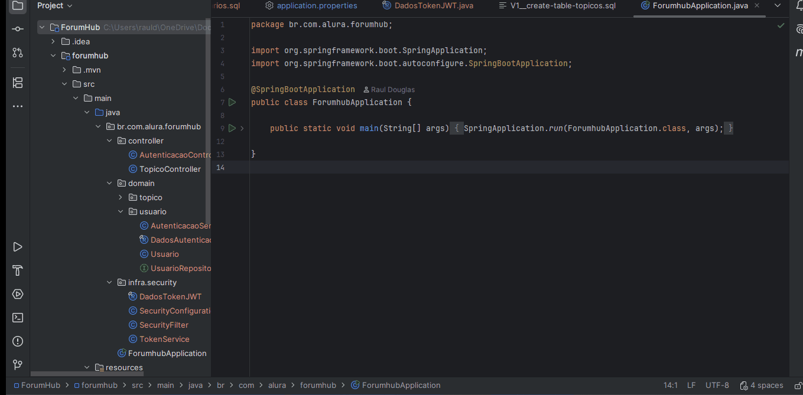

# 💬 FórumHub - API REST


---

## 📌 Sobre o Projeto
O **FórumHub** é uma API RESTful desenvolvida como parte do Challenge Back-End. O objetivo é replicar o funcionamento de um fórum de discussões (como o da Alura), onde os usuários podem criar tópicos, listar dúvidas, atualizar informações e remover discussões encerradas. 

A aplicação foi construída com foco em boas práticas de **Engenharia de Software**, garantindo a integridade dos dados e a segurança das informações através de autenticação Stateless.

---

## ⚙️ Funcionalidades Implementadas
- **CRUD Completo de Tópicos:** Criação, leitura (com paginação), atualização e exclusão física.
- **Autenticação e Autorização:** Sistema de login seguro utilizando tokens JWT (JSON Web Token).
- **Proteção de Rotas:** Filtro de requisições implementado com Spring Security (acesso restrito aos usuários autenticados).
- **Migrações de Banco de Dados:** Controle de versão do esquema do banco via Flyway (Tabelas de Tópicos e Usuários).
- **Validações de Dados:** Utilização do Bean Validation para garantir a integridade das requisições (ex: `@NotBlank`, `@NotNull`).
- **Respostas HTTP Padronizadas:** Retorno adequado dos códigos de status (200 OK, 201 Created, 204 No Content, 401 Unauthorized, 403 Forbidden).

---

## 🛠️ Tecnologias Utilizadas
- **Java 17**
- **Spring Boot 3**
  - Spring Web
  - Spring Data JPA
  - Spring Security
  - Spring Boot Validation
- **Banco de Dados:** MySQL
- **Migrations:** Flyway
- **Autenticação:** Auth0 java-jwt
- **Lombok** (para redução de código boilerplate)
- **Postman** (para testes da API)

---

## 🚀 Como Executar o Projeto

### Pré-requisitos
- Java 17 instalado.
- Maven instalado.
- Servidor MySQL rodando localmente (porta padrão 3306).

### Passo a Passo
1. Clone este repositório:
   ```bash
   git clone https://github.com/Rar388/forum-hub.git

3. Abri o projeto na minha IDE favorita (IntelliJ IDEA, Eclipse, etc).

4. Configurei as credenciais do seu banco de dados no arquivo   ´src/main/resources/application.properties´
    ```bash
   spring.datasource.url=jdbc:mysql://localhost/forumhub
   spring.datasource.username=SEU_USUARIO
   spring.datasource.password=SUA_SENHA
   api.security.token.secret=SUA_CHAVE_SECRETA_JWT

5. Crie o banco de dados forumhub no seu MySQL.

6. Execute a classe principal ForumhubApplication.java. O Flyway criará as tabelas automaticamente.

---

### 🛣️ Endpoints da API

### Autenticação
POST /login: Recebe credenciais e retorna o Token JWT.

Tópicos (Requerem Token JWT no Header 'Authorization: Bearer')
POST /topicos: Cria um novo tópico.

GET /topicos: Retorna a lista de tópicos (paginada).

GET /topicos/{id}: Detalha um tópico específico.

PUT /topicos/{id}: Atualiza os dados de um tópico.

DELETE /topicos/{id}: Exclui um tópico do banco de dados.

---

### 👨‍💻 Autor
Raul Douglas Oliveira Barbosa Desenvolvedor FullStack em formação.

🔗 [GitHub](https://github.com/Rar388?tab=repositories)

🎥 Demonstração da Aplicação

Veja o FórumHub em funcionamento:


